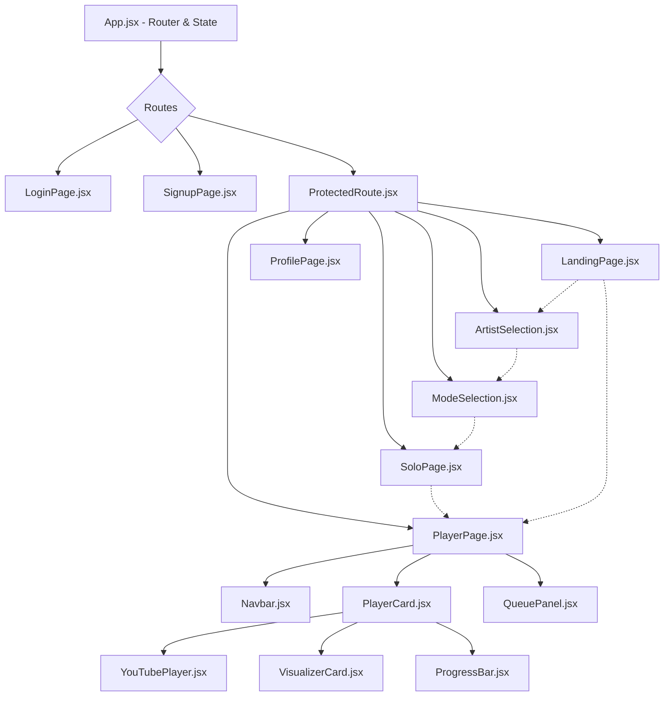

# MoodyDJ UI Structure Diagram

This diagram represents the hierarchy and connection of pages and components within the MoodyDJ client.

## Page Descriptions

| Page | Purpose |
| :--- | :--- |
| **LoginPage / SignupPage** | User authentication and session initiation. |
| **ModeSelection** | Higher-level choice of how to experience the music (Solo/Personalized). |
| **LandingPage** | Main dashboard for selecting moods and toggling personalization. |
| **SoloPage** | Focused mood selection for immediate playback. |
| **PlayerPage** | The core streaming interface where the music plays. |
| **ProfilePage** | Displays user history, stats, and account settings. |
| **ArtistSelection** | Interactive selection of favorite artists to tune the recommendation engine. |

## Component Descriptions

| Component | Responsibility |
| :--- | :--- |
| **Navbar** | Persistent top-level navigation and quick mood switching. |
| **PlayerCard** | Central hub for playback controls, volume, and song metadata. |
| **QueuePanel** | Side/Bottom panel showing upcoming songs and recently played history. |
| **VisualizerCard** | Visual representation of the track (Vinyl animation, Glows). |
| **ProgressBar** | Interactive timeline for seeking through the current track. |
| **YouTubePlayer** | The underlying engine that handles actual media playback via IFrame API. |
